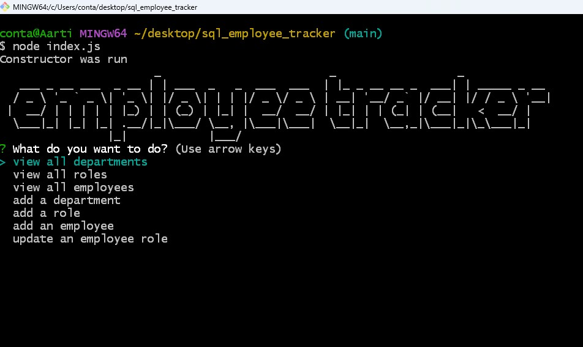
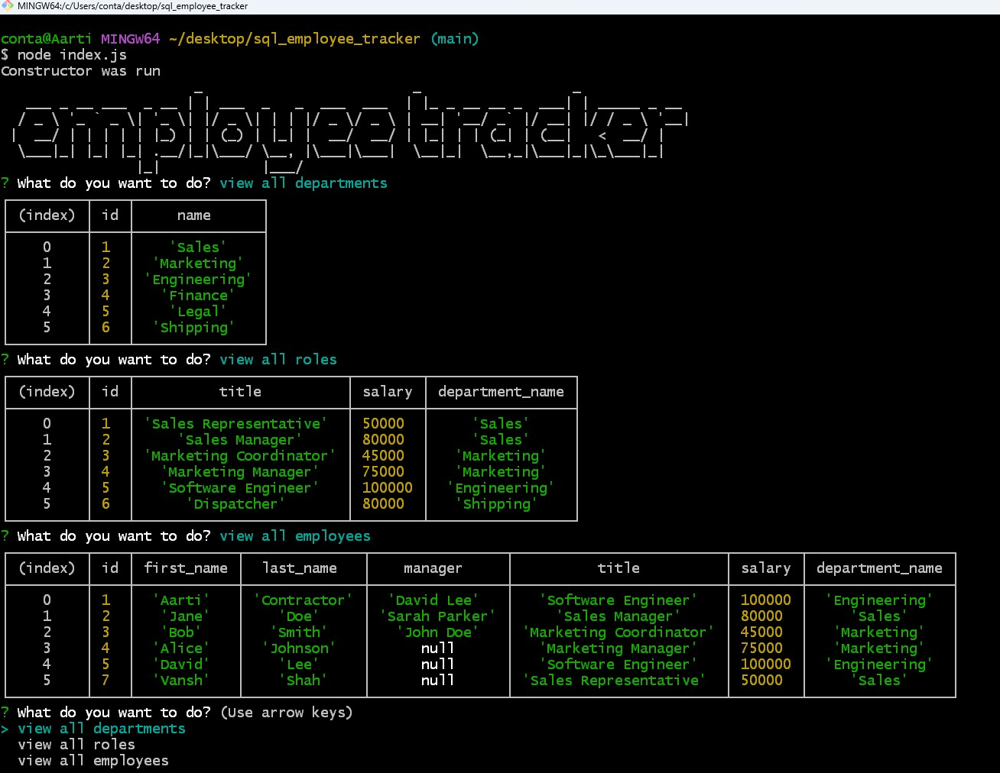

# sql_employee_tracker

## Description

[Walkthrough Video](https://www.youtube.com/watch?v=YwlYj4mHNdM)
<br>
The SQL Employee Tracker is a command-line application made from scratch to manage a company's employee database, using Node.js, Inquirer, and MySQL. This application helps non-developers to easily view and interact with information stored in databases using interfaces called content management systems (CMS).

Using this application, a business owner can view and manage the departments, roles, and employees in his company
so that he can organize and plan his business.

Given a command-line application that accepts user input when the application is started, the user is presented with the following options: 
<br>
view all departments,
<br> 
view all roles,
<br> 
view all employees, 
<br>
add a department,
<br> 
add a role,
<br> 
add an employee, and
<br> 
update an employee role

When the user chooses to view all departments or roles or employees, then user is presented with formatted tables showing the departments (department names and department ids), roles (job title, role id, the department that role belongs to, and the salary for that role), and employees (employee data, including employee ids, first names, last names, job titles, departments, salaries, and managers that the employees report to).
If the user chooses to add a department, or a role, he is prompted with questions to enter the name and role. 
When user wants to update an employee role, he is prompted to select an employee to update and their new role and this information is updated in the database.

<br>
<br>


## Technology Used 

| Technology Used         | Resource URL           | 
| ------------- |:-------------:|    
| Git | [https://git-scm.com/](https://git-scm.com/)     |  
| JavaScript | [https://developer.mozilla.org/en-US/docs/Web/JavaScript](https://developer.mozilla.org/en-US/docs/Web/JavaScript) |  
| NodeJs | [https://nodejs.org/en](https://nodejs.org/en) |
| NPM | [https://www.npmjs.com/](https://www.npmjs.com/) |
| ExpressJS | [https://www.npmjs.com/package/express](https://www.npmjs.com/package/express) |
| Inquirer | [https://www.npmjs.com/package/inquirer](https://www.npmjs.com/package/inquirer) |
| Figlet | [https://www.npmjs.com/package/figlet](https://www.npmjs.com/package/figlet) |
| MySQL | [https://dev.mysql.com/doc/](https://dev.mysql.com/doc/) |


<br>
<br>


## Table of Contents

* [Application Highlights and Usage](#application-highlights-and-usage)
* [Code Snippets](#code-snippets)
* [Learning Points](#learning-points)
* [Author Info](#author-info)
* [Credits](#credits)

<br>
<br>

## Application Highlights and Usage
<br>

1. When a user opens the SQL Employee Tracker in the command line, the following inquire prompt question choices appear along with the figlet text:
<br>
<br>




<br>
<br>
2. When a user chooses to view the department, role and employee tables, the below output tables are shown: 
<br>
<br>



<br>
<br>


## Code Snippets

<br>

1. The following code snippet shows the use of a constuctor class created to store the server and mysql database connection:

```javascript
// created a constructor class which has the SQL connection
class Database {
  constructor() {
    // console.log("Constructor was run");
    this.db = mysql.createConnection({
      host: 'localhost',
      user: 'root',
      password: 'mysql1234@',
      database: 'company_db'
    });
    this.departments = {};
    this.roles = {};
    this.managers = {};
  }
};

```

<br>
<br>


2. The below snippet shows the use of Promise.resolve() method being used:
```javascript
// Created method generateDepartmentChoices to give list options of department names when prompted
 generateDepartmentChoices() {
    return new Promise((resolve, reject) => {
      this.db.query("SELECT name FROM department", (err, results) => {
        if (err) reject(err);
        else {
          const choices = results.map((department) => department.name);
          this.departments = choices; // store the choices array in the object
          resolve(choices);
        }
      });
    });
  }
```

<br>
<br>


## Learning Points 

   I learned the following skills while doing this project:
<br>
- Java script basics (variables,functions, arrays, for-loops, if-else etc)
- How to create a dynamic backend application using the command line
- Basics of NodeJs server and related functions
- How to write database mysql queries (SELECT, INSERT, UPDATE, JOIN, etc.)
- Using the express, inquirer and figlet packages from NPM

<br>
<br>

## Author Info

### Aarti Contractor


- Portfolio: https://aarticontractor.github.io/aarticontractor_portfolio/
- Linkedin: https://www.linkedin.com/in/aarti-contractor/
- Github: https://github.com/aarticontractor

<br>

## Credits

- https://developer.mozilla.org/en-US/docs/Web/JavaScript
- https://cloudconvert.com/webm-to-gif
- https://nodejs.org/en
- https://www.npmjs.com/package/express
- https://developer.mozilla.org/en-US/docs/Glossary/SQL
- https://www.npmjs.com/package/inquirer
- https://dev.mysql.com/doc/
- https://www.npmjs.com/package/figlet


<br>

© 2023 edX Boot Camps LLC. Confidential and Proprietary. All Rights Reserved.